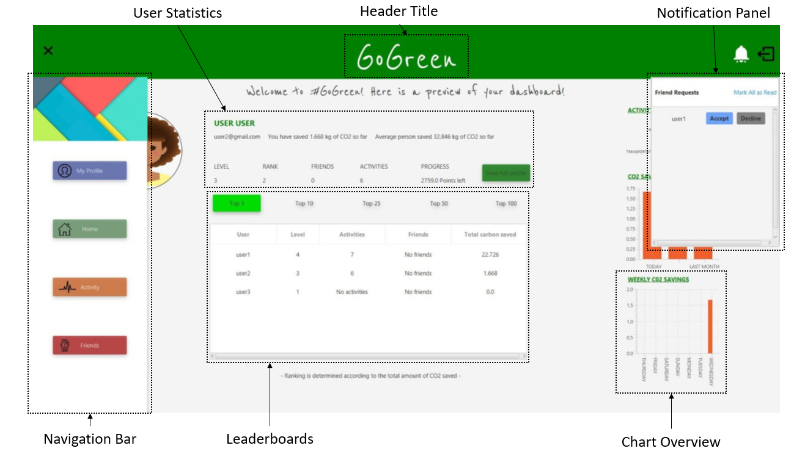
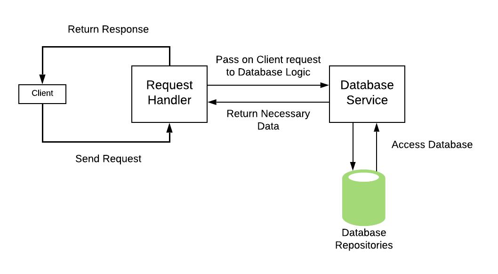

# GoGreen - CSE1105 Group 38 Project

## General
### About
This repository is a complete Java Desktop Application project consisting of 2 parts - the Server & the Client.
The project is a web application that functions much like a social network for tracking the amount of carbon saved per user.

Homepage Overview:

Server Workflow Overview:

### How To Run
1. Clone the repository using the HTTPS link (https://gitlab.ewi.tudelft.nl/cse1105/2018-2019/oopp-group-38/template.git).
To do this in the Bash terminal, run the "git clone" command.
2. Import the project in your favourite Java IDE (such as IntelliJ or Eclipse). The project runs using Maven, therefore
it must be imported as a Maven project.
3. Once imported and the project is opened in the IDE, make sure to build the project. (Preferred JDK 8, although it should
function properly on higher versions)
4. After which, the codebase is ready to be used. It can either be packaged using Maven to produce the required .jars for the application,
or ran from the IDE.

### Starting the Application
1. To start the application without packaging it, run the Server first, which is located under src/main/java/backend/Server.java
2. After running the Server, as many instances of the Client may be opened as needed. The client is located in src/main/java/frontend/gui/Main.java
3. Using this method, the connections will be insecure and run through localhost via port 8080.

### Running Tests
The tests are located in src/test. There are two ways to run the tests:
* IDE - Some Java IDEs allow to run tests and show the coverage results automatically. To do this in IntelliJ, for example, navigate to the test directory,
right click on the java package and click 'Run All Tests'.
* Maven - A universal way to run the tests is to run a Maven command on the project. mvn test will run the tests to check for success, and mvn install will
run the tests to check if the 90% minimum test coverage criteria is met as well.

### Running Checkstyle
* Maven - simply run the Maven command mvn checkstyle:check. Less than 5 warnings must exist for the build to succeed.
* IDE - some Java IDEs have Checkstyle plugins. These can also be used to see the Checkstyle warnings & errors.

### Building Jars
* Server Jar: Simply run the 'mvn package' maven command. This will then appear under target/ as 'GoGreen-1.0.jar'.
* JavaFX Jar: Run the 'jfx:jar' maven command, which will create an executable .jar file for the client.
This will then appear under target/jfx/app/ as 'GoGreen-1.0.jar'.

### Running the Client Jar
java -jar 'GoGreen-1.0.jar'

*Runs the client with connections to localhost*

java -Dremote.url=https://cse38-go-green.herokuapp.com -jar "OOP-Project-0.1-SNAPSHOT-jfx.jar"

*Runs the client with connections to a remote url (in this case, our server running on Heroku)*

### License
GNU 3.0

## Project Formalities

### Requirements

#### Reports & Meetings
* Meeting Agendas & Notes - doc/meetings/
* Checkstyle Reports - doc/reports/checkstyle
* Scrum Screenshots (Sprint Plans) - doc/reports/scrumBoard
* Sprint Reviews - doc/reports/sprint-review
* Test Coverage Reports - doc/reports/weeklyCoverage
* Final report - doc/reports/final-report

#### Mockito Classes
The following test classes (under src/test/java/) contained Mockito based testing (depending on the class, some contained less, some contained more):
* UserRequestHandlerTest.java (backend)
* AppRequestHandlerTest.java (backend)
* DbLoaderTest.java (backend)
* RequestsTest.java (frontend)
* SyncUserTask.java (tools)
* InstallSolarPanelsTest.java (data)
* ActivityTest.java (data)

#### Large PR Example
[Our Largest PR  (Completed Achievements)](https://gitlab.ewi.tudelft.nl/cse1105/2018-2019/oopp-group-38/template/merge_requests/80)

-----------------

