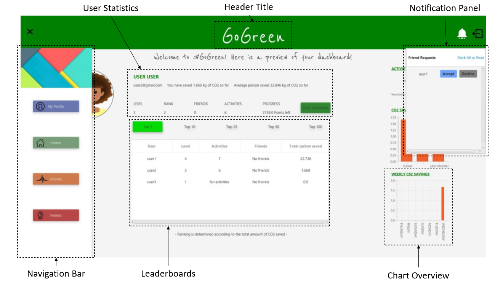
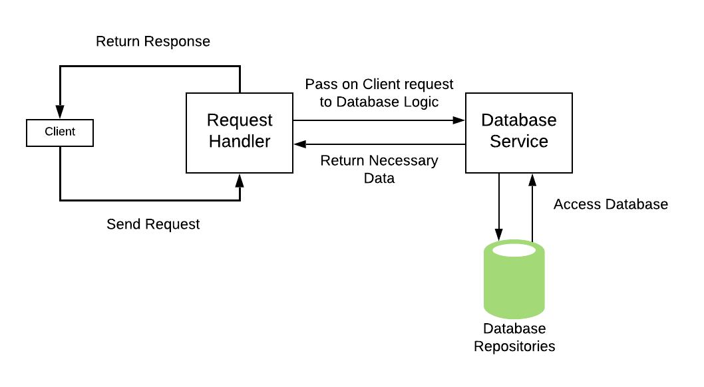
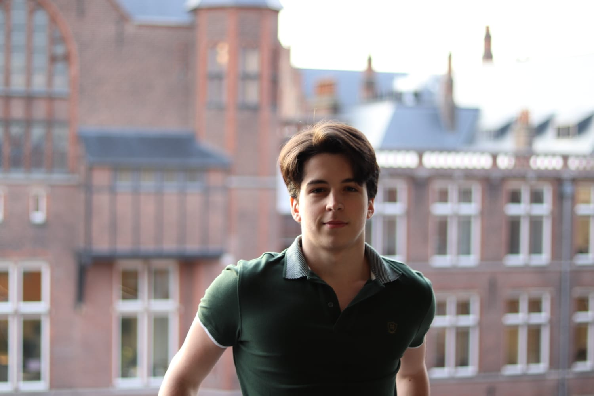
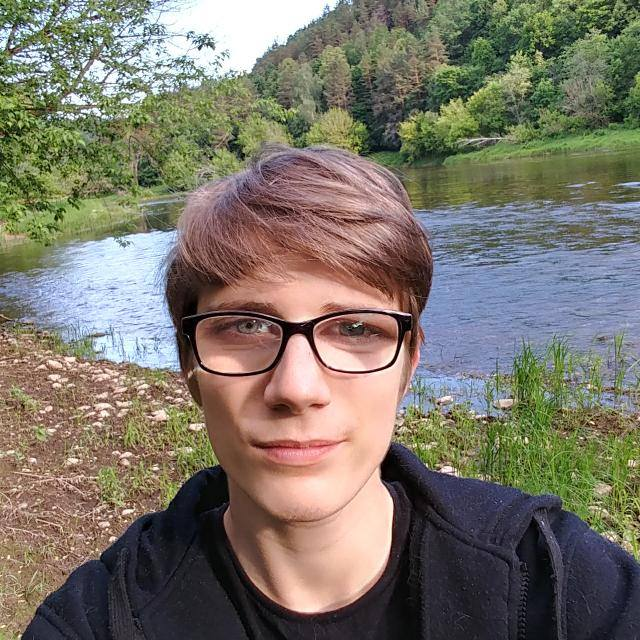
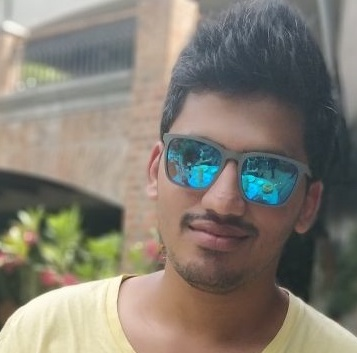
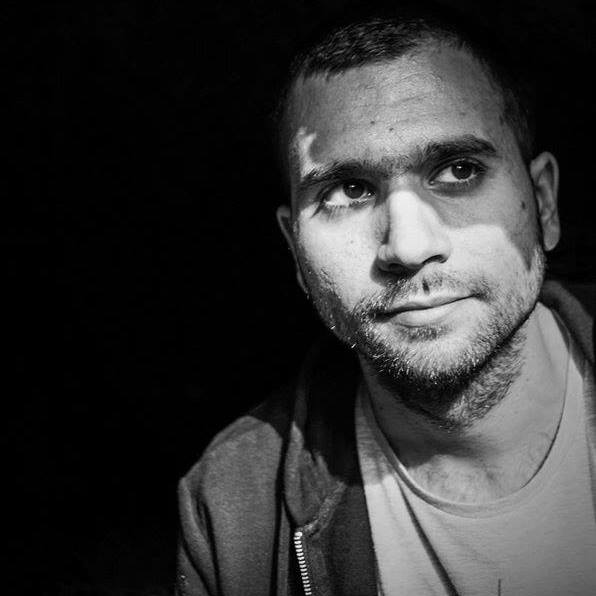

# GoGreen - CSE1105 Group 38 Project

## General
### About
This repository is a complete Java Desktop Application project consisting of 2 parts - the Server & the Client.
The project is a web application that functions much like a social network for tracking the amount of carbon saved per user.

Homepage Overview:

Server Workflow Overview:

### How To Run
1. Clone the repository using the HTTPS link (https://gitlab.ewi.tudelft.nl/cse1105/2018-2019/oopp-group-38/template.git).
To do this in the Bash terminal, run the "git clone" command.
2. Import the project in your favourite Java IDE (such as IntelliJ or Eclipse). The project runs using Maven, therefore
it must be imported as a Maven project.
3. Once imported and the project is opened in the IDE, make sure to build the project. (Preferred JDK 8, although it should
function properly on higher versions)
4. After which, the codebase is ready to be used. It can either be packaged using Maven to produce the required .jars for the application,
or ran from the IDE.

### Starting the Application
1. To start the application without packaging it, run the Server first, which is located under src/main/java/backend/Server.java
2. After running the Server, as many instances of the Client may be opened as needed. The clietn is located in src/main/java/frontend/gui/Main.java
3. Using this method, the connections will be insecure and run through localhost via port 8080.

### Running Tests
The tests are located in src/test. There are two ways to run the tests:
* IDE - Some Java IDEs allow to run tests and show the coverage results automatically. To do this in IntelliJ, for example, navigate to the test directory,
right click on the java package and click 'Run All Tests'.
* Maven - A universal way to run the tests is to run a Maven command on the project. mvn test will run the tests to check for success, and mvn install will
run the tests to check if the 90% minimum test coverage criteria is met as well.

### Running Checkstyle
* Maven - simply run the Maven command mvn checkstyle:check. Less than 5 warnings must exist for the build to succeed.
* IDE - some Java IDEs have Checkstyle plugins. These can also be used to see the Checkstyle warnings & errors.

### Building Jars
* Server Jar: Simply run the 'mvn package' maven command. This will then appear under target/ as 'GoGreen-1.0.jar'.
* JavaFX Jar: Run the 'jfx:jar' maven command, which will create an executable .jar file for the client.
This will then appear under target/jfx/app/ as 'GoGreen-1.0.jar'.

### Running the Client Jar
java -jar 'GoGreen-1.0.jar'

*Runs the client with connections to localhost*

java -Dremote.url=https://cse38-go-green.herokuapp.com -jar "OOP-Project-0.1-SNAPSHOT-jfx.jar"

*Runs the client with connections to a remote url (in this case, our server running on Heroku)*

### License
GNU 3.0

## Project Formalities

### Requirements

#### Reports & Meetings
* Meeting Agendas & Notes - doc/meetings/
* Checkstyle Reports - doc/reports/checkstyle
* Scrum Screenshots (Sprint Plans) - doc/reports/scrumBoard
* Sprint Reviews - doc/reports/sprint-review
* Test Coverage Reports - doc/reports/weeklyCoverage
* Final report - doc/reports/final-report

#### Mockito Classes
The following test classes (under src/test/java/) contained Mockito based testing (depending on the class, some contained less, some contained omre):
* UserRequestHandlerTest.java (backend)
* AppRequestHandlerTest.java (backend)
* DbLoaderTest.java (backend)
* RequestsTest.java (frontend)
* SyncUserTask.java (tools)
* InstallSolarPanelsTest.java (data)
* ActivityTest.java (data)

#### Large PR Example
[Our Largest PR  (Completed Achievements)](https://gitlab.ewi.tudelft.nl/cse1105/2018-2019/oopp-group-38/template/merge_requests/80)

-----------------

### Personal Development Plans

**Vetle Grim Hjelmtvedt**

NetID: vhjelmtvedt
Student number: 4813928

My strong points that would be applicable to working in a team is flexibility and communication. In previous group projects I have been flexible in terms of what task I have to do in that group that may not have been what I wanted to do. Also, I communicated the issues that I had with that task, and other team members were able to help me. 

My weaker points in group projects are delegation of tasks and planning. In previous group projects, I was not too good at delegating the tasks and planning the project. Instead, we would just start doing the project and planning along the way.

My learning goal during this project is learn how an application is actually developed in a team. How the planning is done, and how the work should be delegated.
This is important to me, as I believe it is very applicable to a possible future profession.
I will hopefully achieve this goal by the end of this project.

As of now, I am working with my team to achieve this goal.

What’s stopping me from reaching my goal is laziness. Planning ahead of a project is “less fun” than just starting. However, in this project I will do my best not to do that.

The first step to reaching my goal is am writing this, becoming aware of my goals and how to reach them.

-----------------

**Alexandru Radu Moraru**:

NetID: amoraru

My strong points regarding this project, meaning what would be applicable in this case,
are communication and planning. I think these are shown in a team-based project since I
am able to communicate and interact well with others while also planning ahead of time.
However, one of my weak points might be that I sometimes seem to be a bit bossy and
therefore tend to influnece my ideas on others. Other than that, I think that I am
suitable for a team-project.

My goal regarding this project is to learn useful skills for a future job in IT, since
this is one of my first real big team-based project. I would also like to learn more
regarding graphical interfaces, since I really enjoy this part in such a project and
I feel like I can improve more.

Right now, my team and I are just starting this project. I am willing to dedicate
as much time as possible in order to get a maximum grade(and I think my teammates are
willing to do the same), since I think as long as we put in the work and follow the
guidelines we are going to be able to achieve this goal. I strongly believe that my
teammates are serious about this project and that we are going to do a really good job. 

-----------------

**Evaldas Latoškinas**:

NetID: elatoskinas

Strong Points:

1.Complex Problem Solving - mainly algorithmic problems,
coming up with efficient and fully working solutions for various
problems. I believe this will be useful in a team environment
for handling various complex aspects (mainly features/functionality)
of the application as well as providing code analysis.

2.Planning & Analysis - I have a strong tendency to first analyze
and research what's the quickest and most effective approach to
a certain problem (e.g. what data structures to use, what to use
to implement certain functionality, what database to implement, etc.).
I believe this is highly useful in a team to avoid issues later on
and have an effective solution on the first or second attempt at a
problem.

Weak Points:

1.Design - I feel like I lack creativity and
control on design in general (UI mainly), therefore I feel
like this should not be my main role in a team.

2.Lack of Team Work Experience - the majority of my time I have
only worked on independent projects and tasks, therefore I believe
there will be some difficulty adapting to team work, but I am
prepared to fix this issue and adapt to a team based environment.

Goals:
* Learn to work efficiently in a team (learn Scrum, Agile)
* Learn to reach high and efficient test coverage.
* Learn to plan effectively in a team-based environment.

I believe I will have successfully achieved this goal if we (me and my team)
manage to finish the project in time and according to plan in the period of the course.

Project Expectations:
* Learn efficient planning & team work (Scrum, Agile)
* Become more comfortable in git
* Learn some new, undiscovered things in Java (JavaFX, database implementation, APIs)
* Gain feedback on the process (rather than the product) of our work

-----------------
**Omar Thabet**

NetID : othabet

What are two of your strong points?

1 - I can easily communicate with others.
2 - I'm usually a fast learner.

How is this point shown in a team?

In a team this would improve the efficiency and I it would be more pleasant to my teammates to work with me 

What are two of your weaker points?

I still have a long way to be a proper programmer, I still have a lot to learn in shot amount 

What is your learning goal during this course? , Why is this important to you?

My goal is to have a practical programing experience that would help me in future job and in my everyday life as well as improve my teamwork skills.

When will you have succeeded in achieving this goal?

I would consider it a success if I manage to keep up with my mates and understand all the structures of the program.

Are you actively working on your goal?
What can use improvement?
I think I still need a lot of work to reach my gold
I’m still a beginner in programming and I need to expand my knowledge
I still need to improve my time management skills 

What's my motivation ?
I’m really passionate about my study and how I’m going use my skills to improve humanity also get a ferrari at some point of my life is a great motivation as well.

How my team is going to help me?
My team mate are great people and Im sure they will help me along the way.

----

**Jean Louis Clemente** 

NetID: JClemente

The strong points that I think I contribute to the team are my problem solving and organization skills.
I previous group projects I was able to contribute by effectively delegating work amongst members as well as 
contributing to harder aspects of the project.

I think that some of my weaker points would include, my lack of knowledge in subject and hence 
I feel that I might not be able to contribute as much as would like, 
but I will still try my best to help push my group and myself further.

I would say that my main goal for the project would be, to be  
able to become an overall better programmer and to be able to work more effectively within a group.
I strongly believe by the end of the project I would have achieved these goals and much more,
as I believe this project will really help me get out of my programming shell.

Yes, I am actively working on my goals but have not achieved them yet. 
I think I can improve on this by getting a head start and making sure 
I am well prepared before heading into any challenge.

I have a few options in mind, but nothing set in concrete at the moment.

To reach my main goals I am willing to go above and beyond, mainly because 
I don’t won’t to feel like  the weakest link in the group. 
I am going to start right away, so that I can get a ahead start and 
keep up with the pace of the group and maybe even push ahead. 
I strongly believe that I will rely on my team members to help me achieve this, 
and I think they will be able to this with the
prior experience that they have in programming.

----

**Shashank Anand**:

NetID: shashankanand
Student ID: 4790987

My strong points are being able to solve complex programming problems, also devising 
algorithms to solve them. I am also good at recovering from any mistakes made midway 
through, and being able to identify errors and fix them. I also tend to completely analyze 
the situation before starting to program. 

My weak points are not being able to think creatively, and come up with solutions to vague problems. 
When provided with the exact requirements, I am very good at coming up with a solution 
but, I am quite incapable of being able to creatively solve something. I am also quite weak and 
programming together with other people as I have not had any experience programming as a team prior to this project.

My goals for this project are to be able to work together as a team and get better at being able to split 
tasks, for an entire team to handle. I would also like to improve my creative skills. 
Overall, I would certainly love to become a better programmer than I was before.

I would say that our team is off to a great start, and I believe that we will achieve 
great success by the end of this project.

---

**Kostas Lyrakis**

NetID: klyrakis
Student number: 4799364

Strong Points:

* Analytical skills. I am usually able to break a big problem into very small parts and find my way through an efficient solution.
* Quick learner. I am able to learn new tools and understand new topics fast. 

Weak Points:

* Until now I would prefer to work alone, or with at most one partner, so I tend to be less productive when I work in teams. I hope that I really improve this during the project
* I would describe myself as someone who likes to be involved in every part of a project, so I expect to learn to be trustful towards my partners and not mess with their responsibilities. My team seems a very good place to start since they are all good programmers.

What I expect to get from this project:
* Learn how to work in an agile environment and understand scrum methodology
* Learn to work with the popular tools like git, maven, trello that we will use 
* Obtain marketable skills that will make me more competitive in future job applications

